# Landing page redesign: review and feedback

**Work reviewed:** PR #1, `oa/feat/revamp-landing-page`, merged as `1a6154c` (one commit, 96 files, about 14,900 lines added and 4,600 removed).
**Date:** 18 September 2026

This document explains how the delivered work was graded and what was changed before it went live. Every finding comes with the file and line it refers to, or with a screenshot of your version next to the fixed one. You can check each point for yourself and reply to any of it.

**Where the screenshots come from:**
- "Before" images are your delivery at `1a6154c`.
- "After" images are the sandbox's `main` today, or the live site where the fix was made during the production integration. Each caption says which.
- All screenshots were taken at the same widths with the same sample data.

---

## Summary

| | Grade |
|---|---|
| **Overall, as code to hand over** | **4 / 10** |
| Visual design | 8 / 10 |

The design is good, and it is now live on saturday-racing.com largely as you drew it. The layout, type, colour and imagery are yours.

The code was not ready to hand over. It had debug code that called a local server, a line that breaks our deploy, and sample content that contradicted itself. Sections and features of the live page had been removed without discussion, and about 37 MB of uncompressed images came with it. Integrating it took roughly nine clean-up PRs in this repo, then a further series of PRs in the production site.

The overall grade is for what was delivered: code we could merge. It is not an average of the areas below.

---

## Grades by area

| Area | Grade | Why |
|---|---|---|
| **Visual design** | **8** | Consistent, polished and on-brand, and it held up across every section at desktop and phone widths. This was first graded about 7 before the page could be viewed in a browser. It went up once every section had been checked on screen. |
| **Following the brief** | **4** | Three sections were hidden without asking. Only one of many structural changes was flagged, although the README asked for all of them to be. It came as one very large commit instead of scoped commits. A "Design by" credit was added, and the footer linked to pages that don't exist. |
| **CSS** | **5** | New files were properly scoped, with no global selectors leaking, and focus styles and reduced motion were handled. Against that, the existing design variables weren't used, one hover effect was copied into 9 files, 64 `!important`s were added, and two fonts are used that never load. |
| **JavaScript** | **3** | A debug block sent layout data to `127.0.0.1` on every page load. The Fox filter was changed to match every race. The AI Chamber's content was hard-coded in the JS, and tabs couldn't be used with the keyboard. |
| **Images** | **2** | 37 MB of images, 20 of them over 500 KB (the largest 4.1 MB), 13 never used, and unedited Figma SVG exports. |
| **Tidiness** | **3** | `chrome.css` was fully reformatted, which turned about 600 real changes into a 2,400-line diff. Dead files and debug code were left in. |

**What a 7 would have looked like:** the same design, with compressed images, the existing design variables, no debug code, sections left in place, scoped commits, and a PR description that listed the structural changes.

### What was good

- The visual language is strong and consistent. It needed very little design change to go live.
- The new CSS files are well scoped, so a section's styles don't leak into the rest of the site.
- Focus states and `prefers-reduced-motion` were considered.
- Sections are laid out as separate blocks, which made them easy to move into Django templates one at a time.

---

## Findings, with evidence

### 1. Debug code calling a local server

`static/public/js/day_hub.js`, lines 351–392. On every page load, this block measured the DEN section and posted the result to a local debug endpoint:

```js
// #region agent log
...
fetch('http://127.0.0.1:7631/ingest/51a1334d-…', {
  headers: { 'Content-Type': 'application/json', 'X-Debug-Session-Id': '1bf3af' },
```

On the live site that request fails for every visitor, and it forces a layout recalculation on page load. **Removed in sandbox PR 1.**

### 2. A line that breaks the deploy

`static/public/css/hero-fold.css`, lines 161–168: commented-out `url("../img/courses/ascot.jpg")` and `newbury.jpg` examples. Our production build checks every `url()` in the CSS, including ones inside comments, and those files don't exist, so the deploy stops. We had removed these lines on our side before the snapshot was taken, and the delivery put them back. **Removed in sandbox PR 1.**

### 3. Sample content that contradicted itself

The hero said Mr Fox picked **Dark Cloud Rising 7/2**. Further down the same page, the battle card said **Illinois 40/1**. The "wins this season" counts were also blank.

| Before | After (sandbox) |
|---|---|
|  | 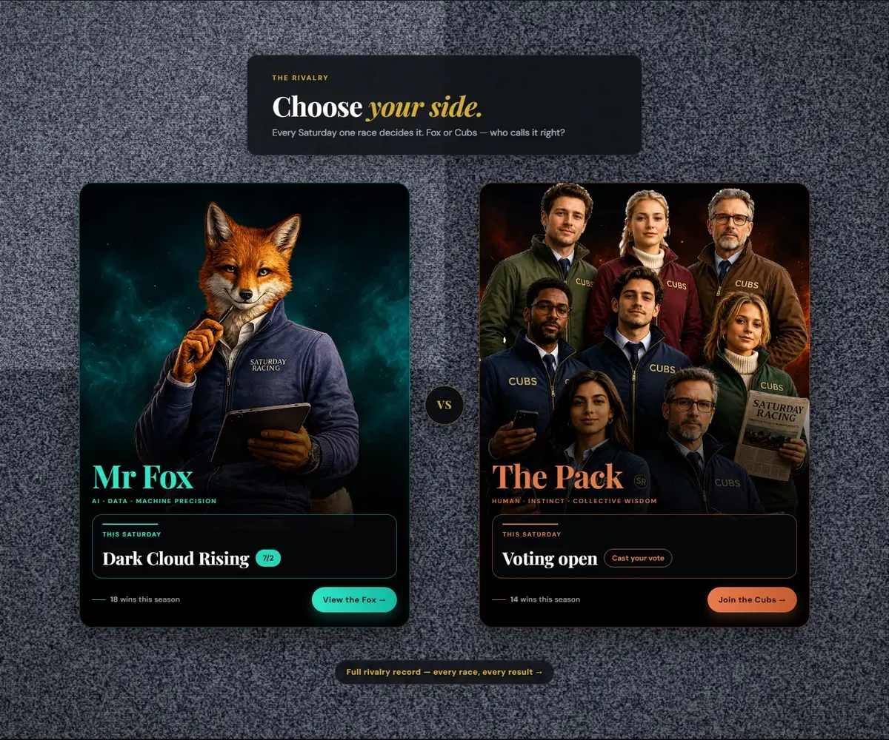 |

The market section listed horses running at Goodwood and Ffos Las. Neither meeting is on that day's card, which is Musselburgh, Lingfield, Bellewstown and Stratford.

| Before | After (sandbox) |
|---|---|
| 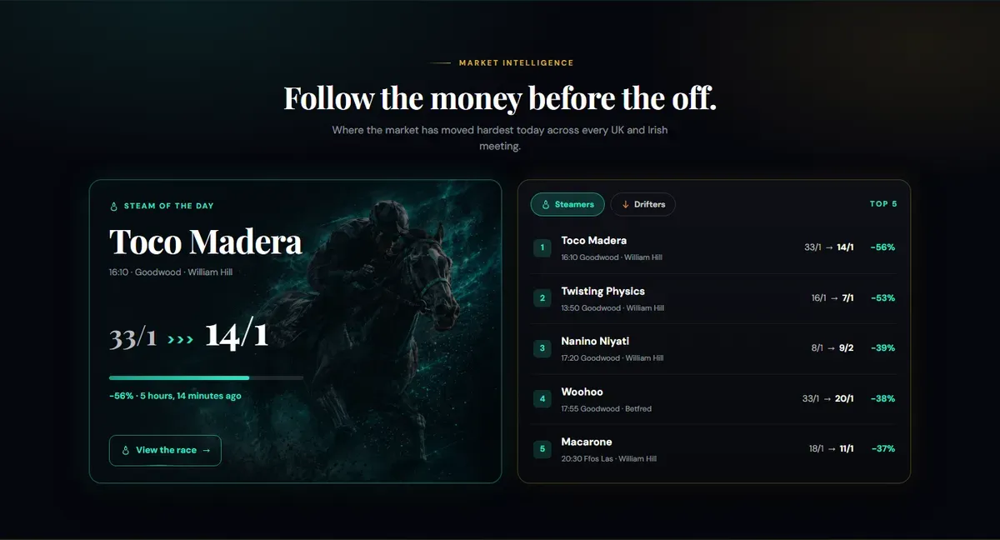 |  |

Two editorial shelf cards were also labelled "Dummy · preview copy" (`index.html:3438`), and the page gave the day's race count as both 34 and 26. The page will run on live data, so every sample value has to agree with the others. That is the only way to catch a wiring mistake by looking at the page. **Fixed in sandbox PR 6.**

### 4. Sections and features removed without discussion

- **Three sections were commented out** as `TEMP HIDDEN`: Syndicates (`index.html:5886`), Track record (`:6034`) and the final call to action (`:6056`).
- **Hero:** the race strip (runners, prize fund, favourite, each-way terms, The Pin), the Pick 6 emblem and the Big Race / Bet of the Day switch were all gone.
- **Battle:** the win counters had lost their numbers (see finding 3).
- **Footer:** Sign in, Join, Pick, Pinsticker, The Experience, Syndicates, Home and the Responsible Gambling link were gone (see finding 7).
- **AI Lab:** the race-data terminal was gone.

All of these were in the snapshot you were given (`596ab4c`). All are back, built with your components and colours:

| Before | After (sandbox) |
|---|---|
| 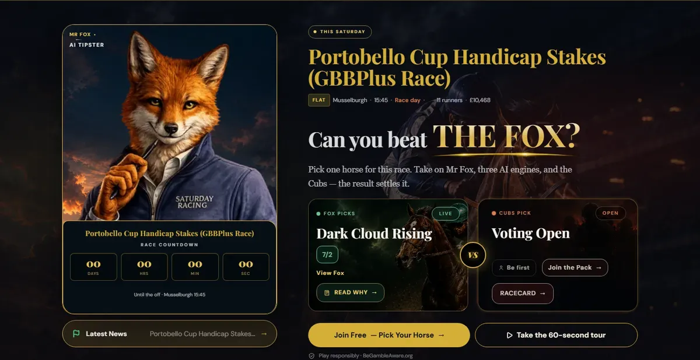 | 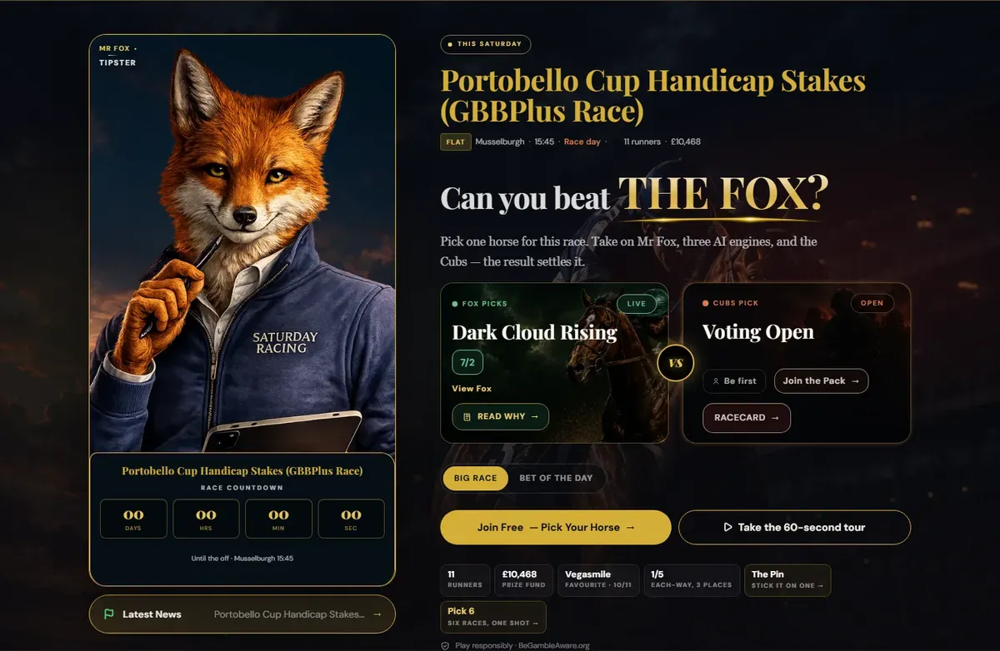 |

The same comparison on a phone (375px wide):

| Before | After (sandbox) |
|---|---|
| 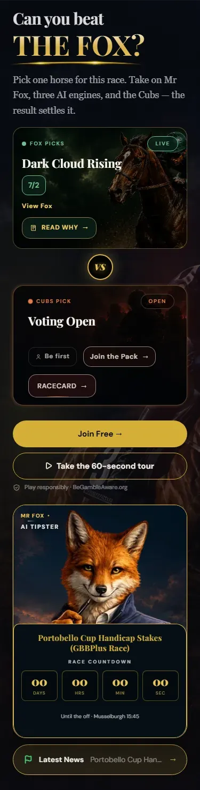 | 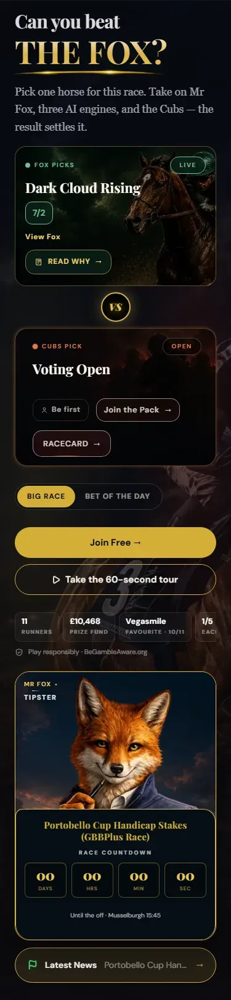 |

The hidden sections, restored and restyled in your design's language for the live site:

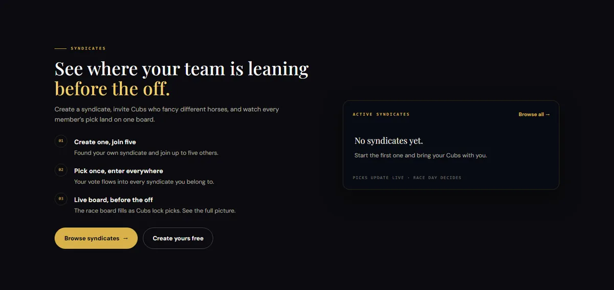

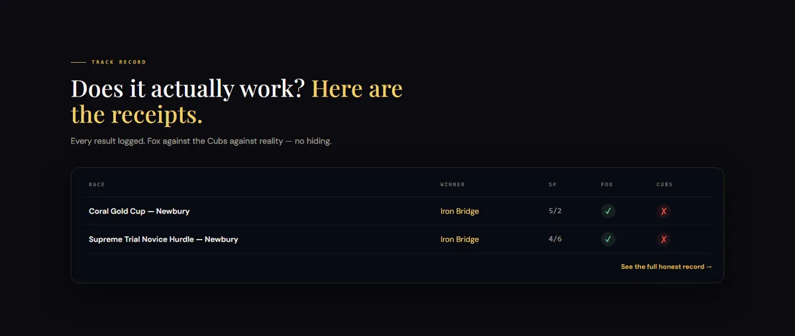

### 5. The Fox filter was changed to match every race

`static/public/js/day_hub.js:43`:

```js
// Snapshot: "fox" shows all races (layout count mirrors All).
var match = (name === 'all' || name === 'fox') || flags.indexOf(name) !== -1;
```

Choosing "Fox picks" showed all 26 races, and every tile said "FOX →" whether or not the Fox had picked it:

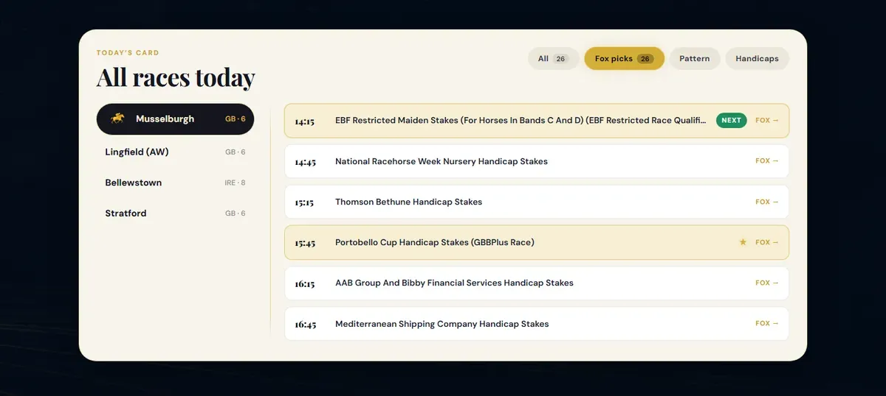

A filter that does nothing looks as though it works in a mock-up, and it is wrong on live data. **Fixed in sandbox PR 3:** the filter matches only races with the Fox flag, and a course left with no matches shows an empty message instead of a blank panel.

### 6. The navigation didn't fit

The new nav styles made the links wider than the space available at common laptop widths, so the items overlapped. This is 1100px wide, with "Mr Fox", "Join Free", "Cubs" and "Login" on top of each other:

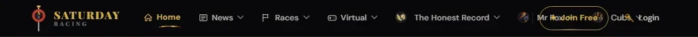

The nav is on all 141 pages of the site, not just the landing page, so it overflowed everywhere. (It was also clipped when signed in. The snapshot only showed the signed-out page, so that part isn't counted against you.) **Fixed during the production integration:** the nav checks whether it fits and switches to the menu button when it doesn't. The link spacing was also trimmed. On the live site:

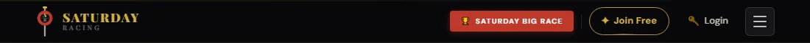

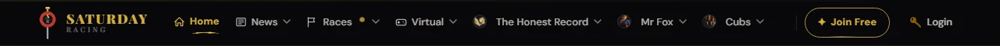

### 7. The footer

| Before | After (sandbox) |
|---|---|
| 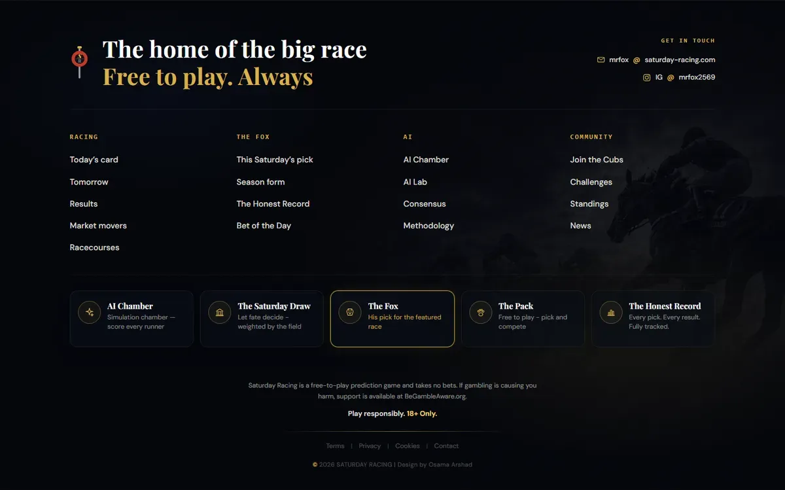 | 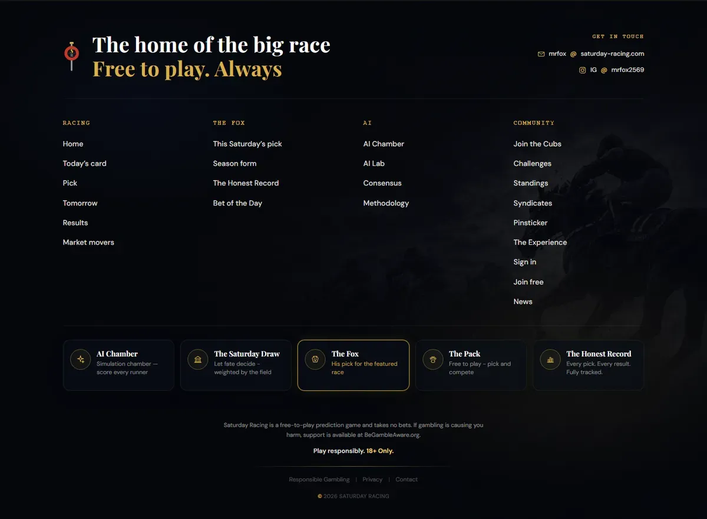 |

- **Dead links:** `/terms/`, `/cookies/`, `/racecourses/` and `/market-movers/` don't exist on the site.
- **Missing links:** the Responsible Gambling link had been dropped, and BeGambleAware was plain text. For a racing site this link is required, not optional.
- **Credit:** a "Design by" credit had been added to a footer that appears on every page.
- **Fonts:** the new footer picked up each page's own body font, so it looked different on the racecard, the news pages and so on. It now sets its own type.

### 8. Brand rule: Mr Fox is not presented as an AI

The hero badge read "MR FOX · AI TIPSTER" (see the hero comparison in finding 4). Mr Fox is presented as our tipster, and AI model names and badges are kept off his areas. The badge now reads "TIPSTER", with the same chip design.

### 9. Images

Measured on `static/public/img`:

| | Delivered | Now |
|---|---|---|
| Total size | 37.1 MB | 1.4 MB |
| Files over 500 KB | 20 | 0 |
| Unused files | 13 (about 9 MB) | 0 |

The largest were `day-hub-bg.png` at 4.1 MB and `rivalry-section-bg.png` at 3.6 MB. Everything was converted to WebP at the size it is actually displayed, with no visible difference; the screenshot tests confirmed it. The SVG exports were cleaned of Figma ids, inline styles and `preserveAspectRatio="none"`. **Sandbox PR 2.**

### 10. CSS standards

- **Design variables:** `#d4af37` was typed out 33 times even though `--c-gold` exists, and Playfair Display was named directly instead of through `var(--font-display)`. **Sandbox PR 4** moved them onto the variables and added your new colours as named variables.
- **Fonts that never load:** "Inter" and "IBM Plex Mono" were used but never loaded, so visitors saw system fallback fonts instead of what you designed.
- **Duplication:** the "liquid fill" button hover was copied into 9 files, with the same keyframes under three names. It is now one shared class.
- **Specificity:** 64 new `!important`s (`battle-section.css` went from 8 to 36).
- **Reformatting:** `chrome.css` was fully reformatted. About 600 real changes became a 2,400-line diff, which made it very hard to review and to merge with the live file. **Sandbox PR 1** reverted the formatting-only changes.

### 11. Accessibility and markup

- The tabs (AI Chamber, Market intelligence, Draw) couldn't be used with the arrow keys. The Draw "tabs" had tab roles but no panels.
- The hero jumped from `h1` to `h3`.
- The scoring table had lost `scope="col"` and its heading label.
- Classes and data attributes the live templates rely on had been removed: `.day-card__fact-body`, `.is-finished`, `.den-cta`, `data-picks-half-href` and `data-count-up`.

**Fixed in sandbox PR 5.** The page now passes an automated accessibility scan at 375, 768, 1024 and 1440px, apart from some colour-contrast items that belong to the palette. The gold-on-cream text in the day hub and How it works is the main one, and it is an open design question.

### 12. States that weren't designed

Real race days often look like this, so the page needs a design for:
- the hero after the race has been run;
- the day hub once racing has finished;
- Challenges with Cubs taking part (only the empty version existed);
- the market section when nothing has moved yet;
- the other four AI Chamber outcomes;
- the nav and footer for a signed-in Cub.

These were designed in your style and collected on `states.html`, so they can be looked at rather than imagined. Two examples:

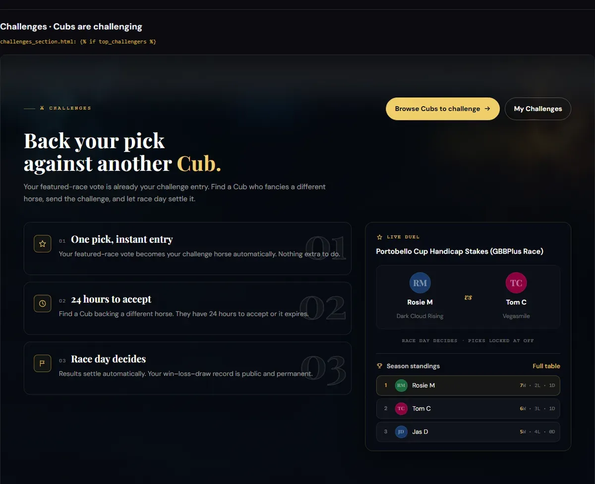

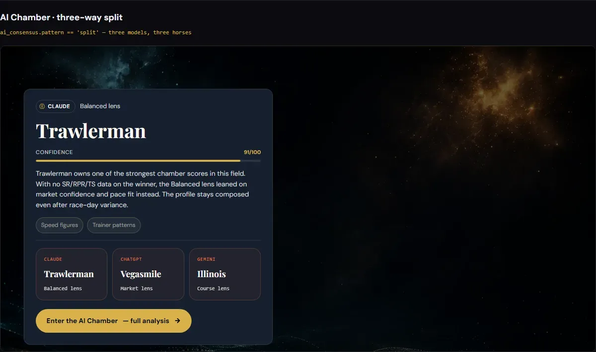

---

## What was done

**In this repository (sandbox):**

| PR | What it did |
|---|---|
| 0 | A safety net: screenshot comparison at four widths, feature checks and a static checker, so the clean-up couldn't change the design by accident |
| 1 | Removed the debug code and the deploy-breaking lines, deleted unused images, reverted the `chrome.css` reformatting |
| 2 | Converted the images to WebP (37 MB down to 1.4 MB) and cleaned the SVGs |
| 3 | JavaScript fixes: the Fox filter, empty states, accessible tabs, AI Chamber content moved into the HTML |
| 4 | Design variables and shared components; closed a gap in the nav breakpoints |
| 5 | Accessibility and markup |
| 6 | Made the sample content consistent and the links real |
| 7 | Restored what had been removed |
| 8 | The states page and the integration map (`docs/integration-map.md`) |
| + | Designed the remaining states, restored the four dropped hero and AI Lab features, synced the nav with production, fixed the footer type |

**In the production site:** the design was ported section by section into the Django templates, on the site's real data. Twelve PRs covered the shared nav and footer, each landing section, and the switch-over, with tests for each. Doing this surfaced the nav overflow on other pages, the footer fonts, and a few contrast problems on the new light panels. All are fixed. It also brought back the signed-in "Welcome back" strip, which the redesign had no design for. That one isn't counted against you, because the snapshot only showed the signed-out page.

The detailed notes are in `docs/`: `integration-map.md`, `chrome-css-changes.md`, `restoration-notes.md`, `content-notes.md`, `accessibility-notes.md` and `image-provenance.md`.

---

## Before handing over next time

- [ ] No debug or logging code, and no calls to localhost
- [ ] Images at 300 KB or less each, and no unused files
- [ ] Colours, fonts and spacing use the `base.css` variables
- [ ] No formatting-only changes to files you're not otherwise changing
- [ ] No sections or features removed without agreement
- [ ] Every structural change, and any content you invent, listed in the PR description
- [ ] Sample content consistent across the page
- [ ] Checked at 375, 768, 1024 and 1440px, signed in and signed out
- [ ] Scoped commits: one per change or group of changes

## Your reply

If you think any finding here is wrong or unfair, reply against its number. Everything above can be checked in this repository: your version is at commit `1a6154c`, and each fix is in the PR named against it.
